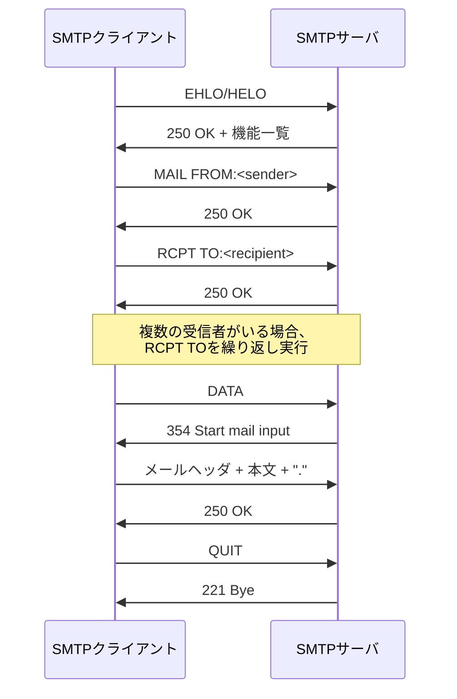

# SMTP通信仕様（骨格版）

## 概要

本ドキュメントは、ettsumailerにおけるSMTP通信機能の骨格レベルの仕様をまとめたものです。
クライアントとしてSMTPサーバと通信する際の基本的な要件とサポートするコマンドについて記載します。

## 準拠するRFC

本実装は以下のRFCに準拠します：

- [RFC5321](https://datatracker.ietf.org/doc/html/rfc5321) - Simple Mail Transfer Protocol (SMTP)
- [RFC7504](https://datatracker.ietf.org/doc/html/rfc7504) - SMTP 521 and 556 Reply Codes
- [RFC5322](https://datatracker.ietf.org/doc/html/rfc5322) - Internet Message Format
- [RFC6854](https://datatracker.ietf.org/doc/html/rfc6854) - Update to Internet Message Format to Allow Group Syntax in the "From:" and "Sender:" Header Fields

## サポートするSMTPコマンド

### 1. EHLO（Extended Hello）
- **目的**: 拡張SMTP機能の有効化とサーバ機能の問い合わせ
- **形式**: `EHLO <domain>`
- **使用場面**: SMTP接続の開始時（HELOの拡張版）
- **必須**: はい

### 2. HELO（Hello）
- **目的**: SMTP通信の開始とクライアント識別
- **形式**: `HELO <domain>`
- **使用場面**: SMTP接続の開始時（基本版）
- **必須**: はい（EHLOが利用できない場合の代替）

### 3. MAIL（Mail From）
- **目的**: 送信者の指定
- **形式**: `MAIL FROM:<sender-email>`
- **使用場面**: メール送信セッションの開始
- **必須**: はい

### 4. RCPT（Recipient）
- **目的**: 受信者の指定
- **形式**: `RCPT TO:<recipient-email>`
- **使用場面**: 宛先指定（複数回実行可能）
- **必須**: はい

### 5. DATA
- **目的**: メール本文の送信開始
- **形式**: `DATA`
- **使用場面**: ヘッダとメール本文の送信
- **必須**: はい
- **注意**: 本文終了は単独行の"."で示す

### 6. RSET（Reset）
- **目的**: 現在のメール送信セッションのリセット
- **形式**: `RSET`
- **使用場面**: エラー回復や新しいメール送信の準備
- **必須**: いいえ

### 7. NOOP（No Operation）
- **目的**: 接続の維持確認
- **形式**: `NOOP`
- **使用場面**: 接続状態の確認やタイムアウト防止
- **必須**: いいえ

### 8. QUIT
- **目的**: SMTP接続の終了
- **形式**: `QUIT`
- **使用場面**: 通信セッションの正常終了
- **必須**: はい

### 9. VRFY（Verify）
- **目的**: メールアドレスの有効性確認
- **形式**: `VRFY <user>`
- **使用場面**: 送信前のアドレス検証
- **必須**: いいえ
- **注意**: セキュリティ上の理由で無効化されることが多い

## 基本的な通信フロー

## クライアント実装要件

### 接続要件
- TCP接続（通常ポート25、587、465）
- TLS/SSL対応（STARTTLS）
- 認証機能（SMTP AUTH）

### エラーハンドリング
- 5xx系エラーに対する適切な処理
- 4xx系エラーに対するリトライ機能
- タイムアウト処理

### セキュリティ要件
- パスワード認証の暗号化
- TLS通信の強制（設定可能）
- 証明書検証

## 今後の詳細化予定

本骨格版の後、以下の詳細仕様を追加予定：

- 具体的なコマンドシーケンス
- エラーコード一覧と処理方法
- 認証方式の詳細（PLAIN、LOGIN、OAUTH2等）
- TLS/SSL実装の詳細
- パフォーマンス要件
- ユースケース別の実装例